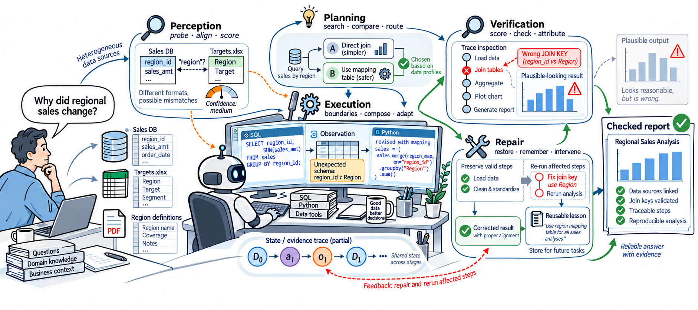
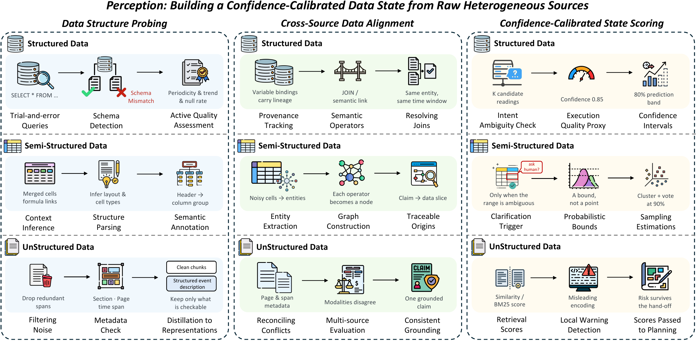
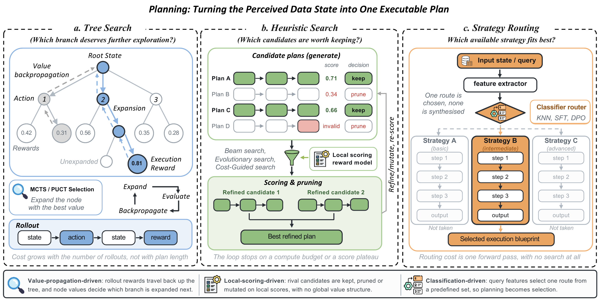
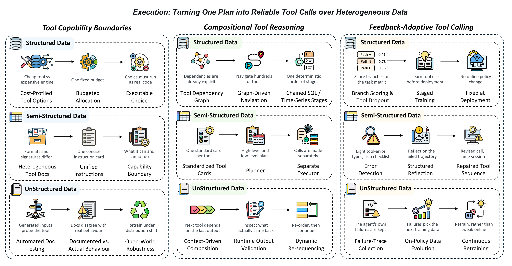
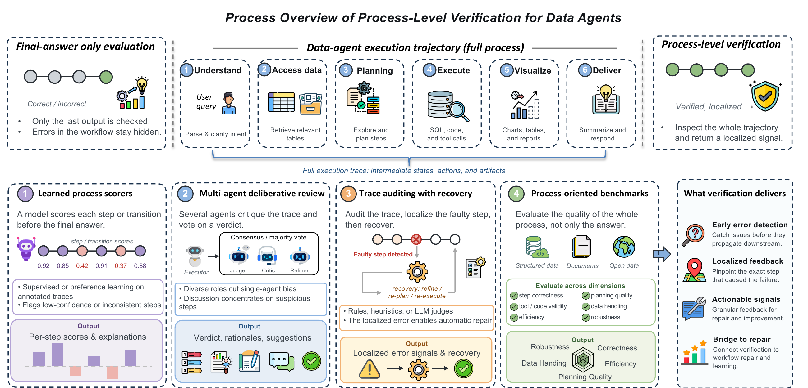
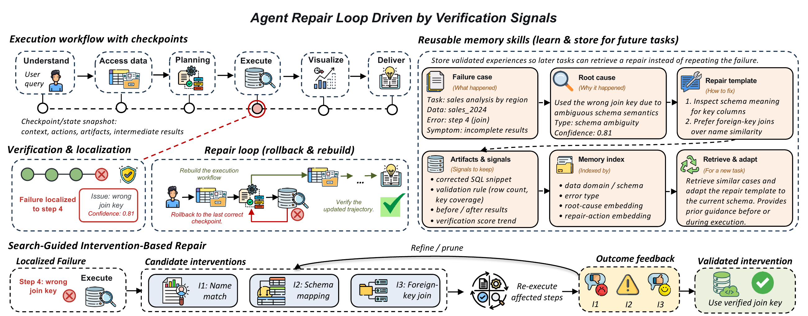
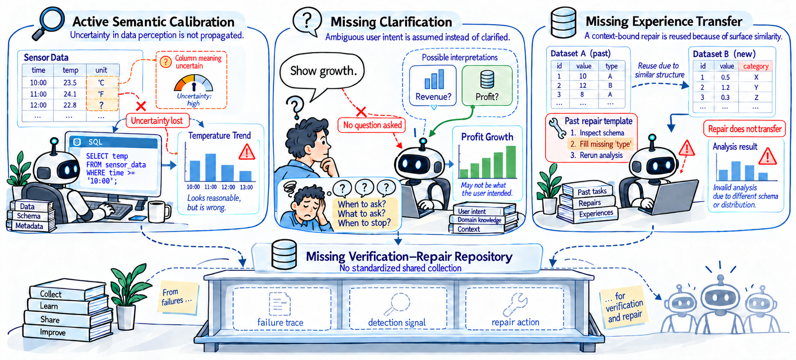

# Awesome Data Agents

Research papers, benchmarks, and projects on **Data Agents**, collected from our survey 📖<em>"**Towards Reliable AI Data Scientists: Data Agents with Workflow Harnesses**"</em>.

🤗 Contributions are welcome! Submit an issue or pull request to suggest papers, add resource links, or correct an entry.

📫 **Contact:** `huachi.zhou@connect.polyu.hk`

---

     
     
<em>The workflow harness of AI Data Scientists: perception, planning, execution, verification, and repair.</em>

## 📜 Catalog

> **[Awesome Data Agents](#awesome-data-agents)**
>
> - **[📖 Overview](#-overview)**
> - **[📚 Related Survey](#-related-survey-papers)**
> - **[🪴 Taxonomy](#-taxonomy)**
>   - [Perception](#perception)
>   - [Planning](#planning)
>   - [Execution](#execution)
>   - [Verification](#verification)
>   - [Repair](#repair)
> - **[🔎 Open Reliability Problems](#-open-reliability-problems)**
> - **[🏆 Benchmark](#-benchmark)**
> - **[📦 Projects](#-projects)**
> - **[📃 Citation](#-citation)**

---

## 📖 Overview

A Data Agent is an LLM-driven system that executes end-to-end data science tasks through interaction with a data environment and computational tools. It observes execution results and iteratively refines its actions to produce analytical artifacts, including cleaned datasets, visualizations, and reports. The survey organizes these systems by five workflow stages and three data types: structured, semi-structured, and unstructured data.

## 📚 Related Survey Papers

- (arXiv'25) **Autonomous Data Agents: A New Opportunity for Smart Data** [[Paper]](https://arxiv.org/abs/2509.18710)
- (arXiv'25) **A Survey of LLM × DATA** [[Paper]](https://arxiv.org/abs/2505.18458)
- (arXiv'25) **A Survey of Data Agents: Emerging Paradigm or Overstated Hype?** [[Paper]](https://arxiv.org/abs/2510.23587)
- (arXiv'25) **A Survey of Reasoning and Agentic Systems in Time Series with Large Language Models** [[Paper]](https://arxiv.org/abs/2509.11575)
- (arXiv'25) **LLM-Based Data Science Agents: A Survey of Capabilities, Challenges, and Future Directions** [[Paper]](https://arxiv.org/abs/2510.04023)
- (arXiv'25) **LLM/Agent-as-Data-Analyst: A Survey** [[Paper]](https://arxiv.org/abs/2509.23988)
- (arXiv'26) **Can LLMs Clean Up Your Mess? A Survey of Application-Ready Data Preparation with LLMs** [[Paper]](https://arxiv.org/abs/2601.17058)
- (arXiv'26) **Data Agents: Levels, State of the Art, and Open Problems** [[Paper]](https://arxiv.org/abs/2602.04261)

## 🪴 Taxonomy

### Perception

     
     
<em>Technical routes for perception across heterogeneous data environments: Data Structure Probing, Cross-Source Data Alignment, and Confidence-Calibrated State Scoring.</em>

#### Structured Data

- (VLDB'26, to appear) **Arming Data Agents with Tribal Knowledge** [[Paper]](https://arxiv.org/abs/2602.13521)
- (arXiv'26) **PV-SQL: Synergizing Database Probing and Rule-based Verification for Text-to-SQL Agents** [[Paper]](https://arxiv.org/abs/2604.17653)
- (COLM'26) **FlexSQL: Flexible Exploration and Execution Make Better Text-to-SQL Agents** [[Paper]](https://arxiv.org/abs/2605.02815)
- (arXiv'26) **TSQAgent: Rating Time Series Data Quality via Dedicated Agentic Reasoning** [[Paper]](https://arxiv.org/abs/2606.03629)
- (arXiv'26) **TimeClaw: A Time-Series AI Agent with Exploratory Execution Learning** [[Paper]](https://arxiv.org/abs/2605.10038)
- (arXiv'26) **OmniTQA: A Cost-Aware System for Hybrid Query Processing over Semi-Structured Data** [[Paper]](https://arxiv.org/abs/2604.02444v1)
- (SIGMOD Companion'26) **Cortex AISQL: A Production SQL Engine for Unstructured Data** [[Paper]](https://arxiv.org/abs/2511.07663)
- (arXiv'26) **SEMA-SQL: Beyond Traditional Relational Querying with Large Language Models** [[Paper]](https://arxiv.org/abs/2604.23477)
- (arXiv'26) **Blue Data Intelligence Layer: Streaming Data and Agents for Multi-source Multi-modal Data-Centric Applications** [[Paper]](https://arxiv.org/abs/2604.15233)
- (EDBT'25) **Entity Matching using Large Language Models** [[Paper]](https://arxiv.org/abs/2310.11244)
- (VLDB'24) **Agent-OM: Leveraging LLM Agents for Ontology Matching** [[Paper]](https://arxiv.org/abs/2312.00326)
- (Findings of EMNLP'24) **R³-NL2GQL: A Model Coordination and Knowledge Graph Alignment Approach for NL2GQL** [[Paper]](https://aclanthology.org/2024.findings-emnlp.800/)

#### Semi-Structured Data

- (arXiv'26) **TabClaw: An Interactive and Self-Evolving Agent for Spreadsheet Manipulation and Table Reasoning** [[Paper]](https://arxiv.org/abs/2606.10316)
- (WSDM'26) **TableMind: An Autonomous Programmatic Agent for Tool-Augmented Table Reasoning** [[Paper]](https://arxiv.org/abs/2509.06278)
- (HILDA'24) **Cocoon: Semantic Table Profiling Using Large Language Models** [[Paper]](https://arxiv.org/abs/2404.12552)
- (arXiv'25) **RubikSQL: Lifelong Learning Agentic Knowledge Base as an Industrial NL2SQL System** [[Paper]](https://arxiv.org/abs/2508.17590)
- (arXiv'25) **AgenticData: An Agentic Data Analytics System for Heterogeneous Data** [[Paper]](https://arxiv.org/abs/2508.05002)
- (arXiv'26) **TwinBI: An Agentic Digital Twin for Efficient Augmented Interactions with Business Intelligence Dashboards** [[Paper]](https://arxiv.org/abs/2606.13731)
- (arXiv'25) **An LLM Agent-Based Complex Semantic Table Annotation Approach** [[Paper]](https://arxiv.org/abs/2508.12868)
- (arXiv'26) **TABQAWORLD: Optimizing Multimodal Reasoning for Multi-Turn Table Question Answering** [[Paper]](https://arxiv.org/abs/2604.03393)
- (arXiv'26) **SemPiper: Interactive Code Synthesis for Semantic Operators in Machine Learning Pipelines** [[Paper]](https://arxiv.org/abs/2606.14361)
- (arXiv'26) **DataSTORM: Deep Research on Large-Scale Databases using Exploratory Data Analysis and Data Storytelling** [[Paper]](https://arxiv.org/abs/2604.06474)
- (arXiv'26) **Beyond Linear LLM Invocation: An Efficient and Effective Semantic Filter Paradigm** [[Paper]](https://arxiv.org/abs/2603.04799)
- (arXiv'25) **CoDA: Agentic Systems for Collaborative Data Visualization** [[Paper]](https://arxiv.org/abs/2510.03194)

#### Unstructured Data

- (arXiv'26) **MimirRAG: A Multi-Agent RAG Framework for Financial Data Retrieval with Metadata Integration** [[Paper]](https://arxiv.org/abs/2605.25030)
- (arXiv'26) **MAVEN: A Multi-stage Agentic Annotation Pipeline for Video Reasoning Tasks** [[Paper]](https://arxiv.org/abs/2605.21917)
- (arXiv'25) **HARMON-E: Hierarchical Agentic Reasoning for Multimodal Oncology Notes to Extract Structured Data** [[Paper]](https://arxiv.org/abs/2512.19864)
- (arXiv'26) **Navigating the Mirage: A Dual-Path Agentic Framework for Robust Misleading Chart Question Answering** [[Paper]](https://arxiv.org/abs/2603.28583)
- (arXiv'25) **Code-in-the-Loop Forensics: Agentic Tool Use for Image Forgery Detection** [[Paper]](https://arxiv.org/abs/2512.16300)
- (arXiv'26) **LongDS-Bench: On the Failure of Long-Horizon Agentic Data Analysis** [[Paper]](https://arxiv.org/abs/2605.30434)
- (arXiv'25) **Doc-Researcher: A Unified System for Multimodal Document Parsing and Deep Research** [[Paper]](https://arxiv.org/abs/2510.21603)

### Planning

     
     
<em>Technical routes for planning: Tree Search, Heuristic Search, and Strategy Routing.</em>

#### Structured Data

- (arXiv'25) **MARS-SQL: A multi-agent reinforcement learning framework for Text-to-SQL** [[Paper]](https://arxiv.org/abs/2511.01008)
- (COLM'26) **FlexSQL: Flexible Exploration and Execution Make Better Text-to-SQL Agents** [[Paper]](https://arxiv.org/abs/2605.02815)
- (ICLR'25) **CHASE-SQL: Multi-Path Reasoning and Preference Optimized Candidate Selection in Text-to-SQL** [[Paper]](https://arxiv.org/abs/2410.01943)
- (PACMMOD'25) **OpenSearch-SQL: Enhancing Text-to-SQL with Dynamic Few-shot and Consistency Alignment** [[Paper]](https://arxiv.org/abs/2502.14913)
- (COLM'25) **EllieSQL: Cost-Efficient Text-to-SQL with Complexity-Aware Routing** [[Paper]](https://arxiv.org/abs/2503.22402)
- (VLDB'25) **SiriusBI: A Comprehensive LLM-Powered Solution for Data Analytics in Business Intelligence** [[Paper]](https://www.vldb.org/pvldb/vol18/p4860-xie.pdf)
- (arXiv'26) **PExA: Parallel Exploration Agent for Complex Text-to-SQL** [[Paper]](https://arxiv.org/abs/2604.22934)
- (SIGIR'25) **Insight Agents: An LLM-Based Multi-Agent System for Data Insights** [[Paper]](https://arxiv.org/abs/2601.20048)

#### Semi-Structured Data

- (AAAI'26) **Jupiter: Enhancing LLM Data Analysis Capabilities via Notebook and Inference-Time Value-Guided Search** [[Paper]](https://arxiv.org/abs/2509.09245)
- (arXiv'26) **SemPipes – Optimizable Semantic Data Operators for Tabular Machine Learning Pipelines** [[Paper]](https://arxiv.org/abs/2602.05134)
- (arXiv'25) **ArchPilot: A Proxy-Guided Multi-Agent Approach for Machine Learning Engineering** [[Paper]](https://arxiv.org/abs/2511.03985)
- (ACL'26) **Mixture-of-Minds: Multi-Agent Reinforcement Learning for Table Understanding** [[Paper]](https://arxiv.org/abs/2510.20176)
- (ICLR'26) **TaTToo: Tool-Grounded Thinking PRM for Test-Time Scaling in Tabular Reasoning** [[Paper]](https://arxiv.org/abs/2510.06217)
- (KDD'26) **Rewarding the Scientific Process: Process-Level Reward Modeling for Agentic Data Analysis** [[Paper]](https://arxiv.org/abs/2604.24198)
- (AAAI'25) **Evolutionary Large Language Model for Automated Feature Transformation** [[Paper]](https://arxiv.org/abs/2405.16203)
- (VLDB'24) **RetClean: Retrieval-Based Data Cleaning Using LLMs and Data Lakes** [[Paper]](https://www.vldb.org/pvldb/vol17/p4421-eltabakh.pdf)
- (arXiv'25) **Dataforge: Agentic Platform for Autonomous Data Engineering** [[Paper]](https://arxiv.org/abs/2511.06185)
- (VLDB'24) **Chat2Data: An Interactive Data Analysis System with RAG, Vector Databases and LLMs** [[Paper]](https://www.vldb.org/pvldb/vol17/p4481-li.pdf)

#### Unstructured Data

- (Findings of EMNLP'25) **MCTS-RAG: Enhancing Retrieval-Augmented Generation with Monte Carlo Tree Search** [[Paper]](https://aclanthology.org/2025.findings-emnlp.672/)
- (VLDB'25) **DocETL: Agentic Query Rewriting and Evaluation for Complex Document Processing** [[Paper]](https://arxiv.org/abs/2410.12189)
- (NeurIPS'24) **UQE: A Query Engine for Unstructured Databases** [[Paper]](https://arxiv.org/abs/2407.09522)
- (CAIS'26) **Do Agents Need to Plan Step-by-Step? Rethinking Planning Horizon in Data-Centric Tool Calling** [[Paper]](https://arxiv.org/abs/2605.08477)
- (arXiv'26) **DeepXiv-SDK: An Agentic Data Interface for Scientific Literature** [[Paper]](https://arxiv.org/abs/2603.00084)
- (arXiv'25) **Doc-Researcher: A Unified System for Multimodal Document Parsing and Deep Research** [[Paper]](https://arxiv.org/abs/2510.21603)
- (PACMMOD'26) **AgenticScholar: Agentic Data Management with Pipeline Orchestration for Scholarly Corpora** [[Paper]](https://arxiv.org/abs/2603.13774)

### Execution

     
     
<em>Technical routes for execution: Tool Capability Boundary Learning, Compositional Tool Reasoning, and Feedback-Adaptive Tool Calling.</em>

#### Tool-Requirement Signals

- (arXiv'26) **AllocBench: Measuring Online Tool Allocation Capability in LLM Agents** [[Paper]](https://arxiv.org/abs/2607.23332)
- (arXiv'25) **Beyond Seeing: Evaluating Multimodal LLMs on Tool-Enabled Image Perception, Transformation, and Reasoning** [[Paper]](https://arxiv.org/abs/2510.12712)
- (arXiv'26) **TimeART: Towards Agentic Time Series Reasoning via Tool-Augmentation** [[Paper]](https://arxiv.org/abs/2601.13653)
- (arXiv'26) **Cast-R1: Learning Tool-Augmented Sequential Decision Policies for Time Series Forecasting** [[Paper]](https://arxiv.org/abs/2602.13802)
- (arXiv'26) **TimeClaw: A Time-Series AI Agent with Exploratory Execution Learning** [[Paper]](https://arxiv.org/abs/2605.10038)

#### Tool-Specification Signals

- (NAACL'25) **EASYTOOL: Enhancing LLM-based Agents with Concise Tool Instruction** [[Paper]](https://aclanthology.org/2025.naacl-long.44/)
- (ICML'26) **NaviAgent: Graph-Driven Bilevel Planning for Scalable Tool Orchestration** [[Paper]](https://arxiv.org/abs/2506.19500)
- (ACL'26) **OctoTools: A Multi-Agent Framework with Extensible Tools for Complex Reasoning** [[Paper]](https://aclanthology.org/2026.acl-long.1/)
- (ICLR'25) **Learning Evolving Tools for Large Language Models** [[Paper]](https://arxiv.org/abs/2410.06617)
- (arXiv'26) **DeepEye: A Steerable Self-driving Data Agent System** [[Paper]](https://arxiv.org/abs/2603.28889)
- (arXiv'26) **Beyond Text-to-SQL: An Agentic LLM System for Governed Enterprise Analytics APIs** [[Paper]](https://arxiv.org/abs/2605.21027)

#### Tool-Feedback Signals

- (arXiv'25) **ToolFuzz: Automated Agent Tool Testing** [[Paper]](https://arxiv.org/abs/2503.04479)
- (arXiv'26) **ToolOmni: Enabling Open-World Tool Use via Agentic Learning with Proactive Retrieval and Grounded Execution** [[Paper]](https://arxiv.org/abs/2604.13787)
- (arXiv'26) **Can Agents Generalize to the Open World? Unveiling the Fragility of Static Training in Tool Use** [[Paper]](https://arxiv.org/abs/2607.01084)
- (Findings of ACL'26) **Failure Makes the Agent Stronger: Enhancing Accuracy through Structured Reflection for Reliable Tool Interactions** [[Paper]](https://arxiv.org/abs/2509.18847)
- (arXiv'25) **ToolCritic: Detecting and Correcting Tool-Use Errors in Dialogue Systems** [[Paper]](https://arxiv.org/abs/2510.17052)
- (arXiv'26) **Towards On-Policy Data Evolution for Visual-Native Multimodal Deep Search Agents** [[Paper]](https://arxiv.org/abs/2605.10832)
- (ICASSP'26) **ReTools: Reflection-Enhanced Tool Invocation for Domain-Specific QA** [[Paper]](https://doi.org/10.1109/icassp55912.2026.11463575)
- (arXiv'26) **SQL-Trail: Multi-Turn Reinforcement Learning with Interleaved Feedback for Text-to-SQL** [[Paper]](https://arxiv.org/abs/2601.17699)

### Verification

     
     
<em>Technical routes for verification: Process Score Estimation, Rule-based Constraint Checking, and Trace-Level Explainable Attribution.</em>

#### Structured Data

- (arXiv'26) **Learning to Retrieve: Dual-Level Long-Term Memory for Text-to-SQL Agents** [[Paper]](https://arxiv.org/abs/2606.00547)
- (PACMMOD'26) **Reward-SQL: Boosting Text-to-SQL via Stepwise Execution-Aware Reasoning and Process-Supervised Rewards** [[Paper]](https://arxiv.org/abs/2505.04671)
- (ICLR'25) **CHASE-SQL: Multi-Path Reasoning and Preference Optimized Candidate Selection in Text-to-SQL** [[Paper]](https://arxiv.org/abs/2410.01943)
- (PACMMOD'25) **OpenSearch-SQL: Enhancing Text-to-SQL with Dynamic Few-shot and Consistency Alignment** [[Paper]](https://arxiv.org/abs/2502.14913)
- (VLDB'25) **E2ETune: End-to-End Knob Tuning via Fine-tuned Generative Language Model** [[Paper]](https://www.vldb.org/pvldb/vol18/p5540-huang.pdf)
- (arXiv'26) **Towards Reliable Agentic Progressive Text-to-Visualization with Verification Rules** [[Paper]](https://arxiv.org/abs/2605.29692)
- (PACMMOD'25) **λ-Tune: Harnessing Large Language Models for Automated Database System Tuning** [[Paper]](https://arxiv.org/abs/2411.03500)
- (arXiv'26) **CausalFlow: Causal Attribution and Counterfactual Repair for LLM Agent Failures** [[Paper]](https://arxiv.org/abs/2605.25338)
- (arXiv'26) **REFLECT: Intervention-Supported Error Attribution for Silent Failures in LLM Agent Traces** [[Paper]](https://arxiv.org/abs/2606.09071)
- (arXiv'26) **PExA: Parallel Exploration Agent for Complex Text-to-SQL** [[Paper]](https://arxiv.org/abs/2604.22934)

#### Semi-Structured Data

- (ACL'25) **Table-Critic: A Multi-Agent Framework for Collaborative Criticism and Refinement in Table Reasoning** [[Paper]](https://aclanthology.org/2025.acl-long.853/)
- (arXiv'26) **TabTracer: Monte Carlo Tree Search for Complex Table Reasoning with Large Language Models** [[Paper]](https://arxiv.org/abs/2602.14089)
- (arXiv'26) **TabClaw: An Interactive and Self-Evolving Agent for Spreadsheet Manipulation and Table Reasoning** [[Paper]](https://arxiv.org/abs/2606.10316)
- (ACL'24) **TaPERA: Enhancing Faithfulness and Interpretability in Long-Form Table QA by Content Planning and Execution-based Reasoning** [[Paper]](https://aclanthology.org/2024.acl-long.692/)
- (PACMMOD'25) **ST-Raptor: LLM-Powered Semi-Structured Table Question Answering** [[Paper]](https://arxiv.org/abs/2508.18190)
- (arXiv'26) **FAMA: Failure-Aware Meta-Agentic Framework for Open-Source LLMs in Interactive Tool Use Environments** [[Paper]](https://arxiv.org/abs/2604.25135)
- (EMNLP'24) **DataNarrative: Automated Data-Driven Storytelling with Visualizations and Texts** [[Paper]](https://aclanthology.org/2024.emnlp-main.1073/)
- (arXiv'25) **Multi-Agent Data Visualization and Narrative Generation** [[Paper]](https://arxiv.org/abs/2509.00481)

#### Unstructured Data

- (NeurIPS'24) **UQE: A Query Engine for Unstructured Databases** [[Paper]](https://arxiv.org/abs/2407.09522)
- (arXiv'26) **LongDS-Bench: On the Failure of Long-Horizon Agentic Data Analysis** [[Paper]](https://arxiv.org/abs/2605.30434)
- (arXiv'26) **DSAEval: Evaluating Data Science Agents on a Wide Range of Real-World Data Science Problems** [[Paper]](https://arxiv.org/abs/2601.13591)
- (arXiv'26) **Navigating Large-Scale Document Collections: MuDABench for Multi-Document Analytical QA** [[Paper]](https://arxiv.org/abs/2604.22239)
- (ACL'26) **UniDataBench: Evaluating Data Analytics Agents Across Structured and Unstructured Data** [[Paper]](https://aclanthology.org/2026.acl-long.1556.pdf)
- (arXiv'26) **Sanity Checks for Agentic Data Science** [[Paper]](https://arxiv.org/abs/2604.11003)
- (arXiv'26) **Failure is Feedback: History-Aware Backtracking for Agentic Traversal in Multimodal Graphs** [[Paper]](https://arxiv.org/abs/2602.03432)

### Repair

     
     
<em>Technical routes for repair: Data State Reconstruction, Search-Guided Intervention-Based Repair, and Reusable Memory Skills.</em>

#### Structured Data

- (VLDB'25) **SagaLLM: Context Management, Validation, and Transaction Guarantees for Multi-Agent LLM Planning** [[Paper]](https://arxiv.org/abs/2503.11951)
- (arXiv'26) **DART: Semantic Recoverability for Structured Tool Agents** [[Paper]](https://arxiv.org/abs/2605.23311)
- (arXiv'26) **AgentFixer: From Failure Detection to Fix Recommendations in LLM Agentic Systems** [[Paper]](https://arxiv.org/abs/2603.29848)
- (arXiv'26) **Learning to Retrieve: Dual-Level Long-Term Memory for Text-to-SQL Agents** [[Paper]](https://arxiv.org/abs/2606.00547)
- (arXiv'26) **CausalFlow: Causal Attribution and Counterfactual Repair for LLM Agent Failures** [[Paper]](https://arxiv.org/abs/2605.25338)

#### Semi-Structured Data

- (arXiv'26) **Auditing and Controlling AI Agent Actions in Spreadsheets** [[Paper]](https://arxiv.org/abs/2604.20070)
- (arXiv'26) **A Self-Healing Framework for Reliable LLM-Based Autonomous Agents** [[Paper]](https://arxiv.org/abs/2605.06737)
- (arXiv'26) **Unsupervised Skill Discovery for Agentic Data Analysis** [[Paper]](https://arxiv.org/abs/2606.06416)
- (arXiv'26) **Robust Tool Use via Fission-GRPO: Learning to Recover from Execution Errors** [[Paper]](https://arxiv.org/abs/2601.15625)
- (Findings of ACL'26) **Failure Makes the Agent Stronger: Enhancing Accuracy through Structured Reflection for Reliable Tool Interactions** [[Paper]](https://arxiv.org/abs/2509.18847)
- (arXiv'25) **CoDA: Agentic Systems for Collaborative Data Visualization** [[Paper]](https://arxiv.org/abs/2510.03194)
- (Findings of ACL'24) **MatPlotAgent: Method and Evaluation for LLM-Based Agentic Scientific Data Visualization** [[Paper]](https://aclanthology.org/2024.findings-acl.701/)

#### Unstructured Data

- (arXiv'26) **Doctor-RAG: A Failure-Aware Repair Framework for Agentic Retrieval-Augmented Generation** [[Paper]](https://arxiv.org/abs/2604.00865)
- (arXiv'25) **Multi-Objective Agentic Rewrites for Unstructured Data Processing** [[Paper]](https://arxiv.org/abs/2512.02289)
- (arXiv'26) **FinAcumen: Financial Multimodal Reasoning via Self-Evolving Experience Memory Harness** [[Paper]](https://arxiv.org/abs/2606.17642)
- (SIGIR'26) **Deep Search with Hierarchical Meta-Cognitive Monitoring Inspired by Cognitive Neuroscience** [[Paper]](https://arxiv.org/abs/2601.23188)

## 🔎 Open Reliability Problems

     
     
<em>Four open reliability problems: (1) the Inactive Semantic Calibration Problem, (2) the Missing Clarification Problem, (3) the Missing Experience Transfer Problem, and (4) the Missing Verification-Repair Repository Problem.</em>

## 🏆 Benchmark

| Benchmark | Focus | Task & Process Coverage | Evaluation | Paper | Repo |
| --- | --- | --- | --- | --- | --- |
| StockGQL | Natural-language-to-GQL translation over structured financial knowledge. | Data Querying; Execution, Verification | Query correctness and retrieval of the required information. | [Paper](https://arxiv.org/abs/2412.10434) | [Code](https://github.com/leonyuancode/StockGQL) |
| TableBench | Table question answering covering fact checking, numerical reasoning, data analysis, and visualization. | Data Querying; Verification | TableQA accuracy across multiple reasoning categories. | [Paper](https://arxiv.org/abs/2408.09174) | [Code](https://github.com/TableBench/TableBench) |
| Visual-TableQA | Visual reasoning over rendered tables, including structure understanding and multi-step reasoning. | Visualization and Multimodal Analysis; Verification | Question-answering and reasoning accuracy on table images. | [Paper](https://arxiv.org/abs/2509.07966) | — |
| TopBench | Implicit predictive reasoning over tabular data, including prediction, decision making, and treatment-effect analysis. | Analysis and Prediction; Verification | Performance on analytical objectives beyond direct table lookup. | [Paper](https://arxiv.org/abs/2604.28076) | [Data](https://huggingface.co/datasets/LAMDA-Tabular/TopBench) |
| PrepBench | Natural-language-driven data preparation involving cleaning, restructuring, and table transformation. | Data Preparation; Execution, Verification | Correctness of generated output tables across preparation settings. | [Paper](https://arxiv.org/abs/2605.08687) | — |
| InfiAgent-DABench | End-to-end data analysis over CSV files requiring agents to interact with an execution environment. | Analysis and Prediction; Planning, Execution | Automatically evaluated answers across diverse analytical questions. | [Paper](https://arxiv.org/abs/2401.05507) | [Code](https://github.com/InfiAgent/InfiAgent) |
| LongDA | Documentation-intensive data analysis requiring retrieval from long documents before computation and code execution. | Information Seeking, Analysis; Planning, Execution | Answer accuracy, token efficiency, runtime, and tool interactions. | [Paper](https://arxiv.org/abs/2601.02598) | — |
| IDA-Bench | Interactive, multi-round data analysis derived from Kaggle notebooks with sequential instructions. | Analysis and Prediction; Planning, Execution, Verification | Submission success, baseline achievement, turns, runtime, and generated code. | [Paper](https://arxiv.org/abs/2505.18223) | — |
| TableAgentBench | Multi-turn table analysis over real-world industrial spreadsheets requiring iterative reasoning and tool use. | Data Querying; Planning, Execution, Verification | Task completion across multi-turn table-analysis scenarios. | [Paper](https://openreview.net/pdf?id=5yZAgkjGQ0) | [Code](https://github.com/201983290498/TableAgentBench) |
| DataGovBench | Data analysis over government open data, covering table QA and exploratory insight generation. | Querying, Visualization; Execution, Verification | Analytical answers and quality of generated insights. | [Paper](https://arxiv.org/abs/2607.06482) | — |
| LongDS-Bench | Long-horizon, multi-turn data science tasks with evolving analytical states and intermediate results. | Analysis and Prediction; Planning, Execution, Verification | Turn-level accuracy and completion of extended analytical trajectories. | [Paper](https://arxiv.org/abs/2605.30434) | — |
| DAComp | Data engineering and open-ended data analysis spanning the data-intelligence lifecycle. | Cross-task; Planning, Execution, Verification | Execution-based metrics for engineering and rubric-based analysis evaluation. | [Paper](https://arxiv.org/abs/2512.04324) | [Code](https://github.com/ByteDance-Seed/DAComp) |
| FDABench | Data analysis over heterogeneous structured, unstructured, and multimodal sources. | Cross-task; Planning, Execution, Verification | Answer correctness, report quality, reasoning traces, latency, and token usage. | [Paper](https://arxiv.org/abs/2509.02473) | [Code](https://github.com/fdabench/FDAbench) |
| CODA-BENCH | Data-intensive code-agent tasks requiring data discovery, code generation, and execution. | Analysis and Prediction; Planning, Execution, Verification | Data discovery and successful completion of executable analytical tasks. | [Paper](https://arxiv.org/abs/2606.15300) | [Website](https://coda-bench.github.io/) |
| DataSciBench | Data science tasks requiring agents to generate and execute analytical programs. | Analysis and Prediction; Execution, Verification | Programmatic evaluation of generated programs and execution results. | [Paper](https://arxiv.org/abs/2502.13897) | [Website](https://datascibench.github.io/) |
| AgentGym | Real-world agent tasks involving tool discovery, selection, and multi-step interaction. | Cross-task; Planning, Execution, Verification | Task success and tool-use behavior across interactive environments. | [Paper](https://arxiv.org/abs/2406.04151) | [Website](https://agentgym.github.io/) |
| FinRpt | Equity research report generation integrating multiple financial data types. | Analysis and Prediction; Planning, Execution, Verification | Multi-dimensional evaluation of generated research reports. | [Paper](https://arxiv.org/abs/2511.07322) | — |
| PolitNuggets | Agentic discovery and synthesis of long-tail facts from dispersed information sources. | Information Seeking; Planning, Execution, Verification | Evidence discovery, fine-grained factual accuracy, and efficiency. | [Paper](https://arxiv.org/abs/2605.14002) | — |

## 📦 Open-source Projects

-  Agent-OM: Leveraging LLM Agents for Ontology Matching
-  DocETL: Agentic Query Rewriting and Evaluation for Complex Document Processing
-  Jupiter: Enhancing LLM Data Analysis Capabilities via Notebook and Inference-Time Value-Guided Search
-  SiriusBI: A Comprehensive LLM-Powered Solution for Data Analytics in Business Intelligence
-  E2ETune: End-to-End Knob Tuning via Fine-Tuned Generative Language Model
-  Learning Evolving Tools for Large Language Models
-  MCTS-RAG: Enhancing Retrieval-Augmented Generation with Monte Carlo Tree Search
-  MatPlotAgent: Method and Evaluation for LLM-Based Agentic Scientific Data Visualization
-  ST-Raptor: LLM-Powered Semi-Structured Table Question Answering

## 🚀 Applications

### Interactive Data Assistance

- [Fabi Analyst Agent](https://www.fabi.ai/product/analyst-agent): Natural-language analysis, Python and SQL computation, dashboards, and collaborative access.
- [V7 AI Spreadsheet Analysis Agent](https://www.v7labs.com/agents/ai-spreadsheet-analysis-agent): Spreadsheet questions, calculations, summaries, and visualizations.

### Collaborative Analytical Work

- [GPT for Work](https://gptforwork.com/): Formula generation and repair, data cleaning, charts, pivot tables, and bulk row processing in Microsoft Excel and Google Sheets.
- [Codex](https://openai.com/codex/): Data, code, and analytical artifacts within a shared workflow.

### Autonomous Data Workflows

- [Snowflake CoCo](https://www.snowflake.com/en/product/features/cortex/): Multi-step data engineering, analytics, machine learning, and agent-building tasks.
- [Snowflake Cortex Agents](https://docs.snowflake.com/en/user-guide/snowflake-cortex/cortex-agents): Structured data access, unstructured retrieval, and code execution, with repeated tool selection and evaluation of intermediate results.
- [Databricks Genie Code](https://www.databricks.com/product/genie/code): Planning, data retrieval, code generation and execution, output inspection, and error recovery.
- [Manus](https://manus.im/solutions/product): Spreadsheet and CSV analysis, chart and report generation, and reusable workflows.

### Knowledge-Intensive Discovery

- [Manus](https://manus.im/solutions/product): External research, evidence synthesis, structured analysis, and report generation.
- [Pelayar Spreadsheet Agent](https://pelayar.ai/): Extracting information from PDFs, invoices, images, and other documents into spreadsheets for analysis.

## 📃 Citation

